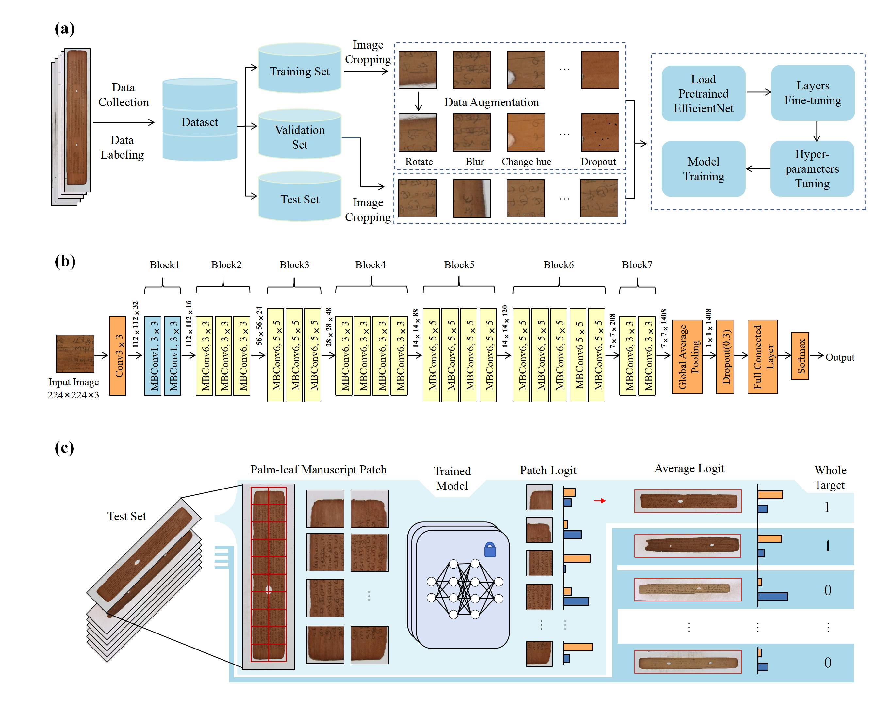

# Palm-leaf manuscript plant genus identification based on EfficientNet
## Background
There are millions of palm-leaf manuscripts distributed around the world that require the determination of their plant genera to carry out subsequent traceability, conservation, restoration, and exhibition efforts. However, the traditional method for identifying the plant genus of palm leaf manuscripts is too inefficient. In this study, a method named PLNet was proposed for **p**alm-**l**eaf manuscript plant genus identification based on Efficient**Net**.PLNet is a quick and automated method for palm-leaf manuscript plant genus identification when the labeled training data is limited.

### Package required:
We recommend to use [conda](https://conda.io/docs/user-guide/install/download.html) and [pip](https://pypi.org/project/pip/).
- [python3](https://www.python.org/)
- [pytorch](https://pytorch.org/) 

By using the [`environment.yml`](https://github.com/yxcsu/PLNet/blob/master/environment.yml), [`requirements.txt`](https://github.com/yxcsu/PLNet/blob/master/requirements.txt) file, it will install all the required packages.

    git clone https://github.com/yxcsu/PLNet.git
    cd PLNet
    conda env create -f environment.yml
    conda activate PLNet
    

## Dataset
Data resources can be obtained from publicly available palm-leaf manuscript image databases.

## Data augmentation

The overlapped peak dataset for training, validating and testing the GCMSFormer model is obtained using the [data_augment](https://github.com/yxcsu/PLNet/blob/master/Data_Augment/data_augment.py) functions.

    train_transform,test_transform = data_augment(para)

*Optionnal args*
- para : Data augmentation parameters 

## Clone the repository and run it directly
[git clone](https://github.com/yxcsu/PLNet)

An example has been provided in [test.ipynb](https://github.com/yxcsu/PLNet/blob/master/test.ipynb) 
script for the convenience of users. The PLNet model is public at [release](https://github.com/1393131688/PLNet/releases/download/v1.0.0/model.zip), every user can download and use it. 

## Software installation
The current install version of PLNet only supports Windows 64-bit version. It has been test on _**Windows 7**_,_**Windows 10**_ and _**Windows 11**_.

Install Package: [PLNet](https://drive.google.com/file/d/1EpwKRBhgwKbhtSqJ8iOSqoMdHEWuraag/view?usp=drive_link)

## Software usage
1.predict

https://github.com/yxcsu/PLNet/assets/75461756/2eb4b5af-9eff-4e0e-a9b9-a61dcfa99fb0

2.save data

https://github.com/yxcsu/PLNet/assets/75461756/448ef21c-3a20-47df-bbbb-d9fa9a085e49

3.save report

https://github.com/yxcsu/PLNet/assets/75461756/b1160749-87dd-45cb-94ab-0a4db57ee2ec

4.delete photos

https://github.com/yxcsu/PLNet/assets/75461756/5975f834-4e1b-4944-b6d0-803ba336d179

## Contact
- zmzhang@csu.edu.cn
- 222311026@csu.edu.cn